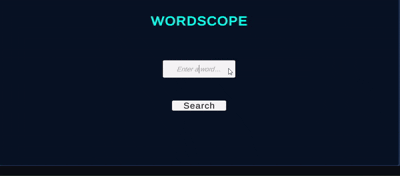

# 🔍 WordScope – A Simple Unity Dictionary App

**WordScope** is a beginner-friendly Unity mini-app that fetches English word definitions using the [Free Dictionary API](https://dictionaryapi.dev/).  
It features clean input validation, API fetching via `UnityWebRequest` and console-based output with a readable project structure.

---

## ✨ Features

-  Fetches real-time definitions for user-entered words
-  Validates word input using a Regex-based utility class
-  Uses `UnityWebRequest` to call an API
-  Parses JSON using Unity's built-in `JsonUtility` with a custom wrapper
-  Outputs the definition in the Console (with the word bolded and capitalized)
-  Displays `Loading...` while fetching
-  Handles network/API errors and invalid input gracefully
-  Modular code with utility classes (`JsonUtils`, `ValidationUtils`) and data models
-  Compatible with Unity 2022.3+ (LTS)

---

## 🧩 Project Structure

```
Assets/
├── Scenes/
│ └── WordScope.unity	# Main executable scene with all setup
├── Scripts/
│ ├── DictionaryLookup.cs # Main MonoBehaviour with API logic to connect UI
│ ├── Utils/
│ │ ├── JsonUtils.cs # Wraps and parses JSON responses
│ │ └── ValidationUtils.cs # Regex-based input validation
│ └── Json/
│ └── DictionaryModels.cs # Serializable model classes for parsing API response
├── TextMesh Pro/ # For improved UI styling
```

---

## 🖥️ UI Setup (Scene)

- `Canvas` → Contains a `Panel` with:
  - `WordInput` (TMP-Input Field)
  - `SearchButton` (Button)
  - `Title` (TMP-Text(UI))
- `DictionaryManager` → Empty GameObject with `DictionaryLookup.cs` attached

---

## 🔗 API Reference

- **Endpoint:**  
  `https://api.dictionaryapi.dev/api/v2/entries/en/{word}`

- Example response (simplified):
```json
[
  {
    "word": "unity",
    "meanings": [
      {
        "partOfSpeech": "noun",
        "definitions": [
          {
            "definition": "the state of being united or joined as a whole",
            "example": "national unity is essential"
          }
        ]
      }
    ]
  }
]
```

---

## ⚙ How It Works

- **Validation:**
	ValidationUtils.IsValidWord(string word)
	→ Ensures the input contains only English letters.

- **Fetching:**
	UnityWebRequest.Get() fetches the definition asynchronously.

- **Parsing:**
	JsonUtils.GetFirstDefinition(string json)
	→ Uses a RootWrapper class to allow JsonUtility to parse root-level arrays.

- **Output:**
	Final result is logged as:
	<b>Unity</b>: the state of being united or joined as a whole

---

## ▶ How to Run

1. Open project in Unity 2022.3 LTS or higher.

2. Load the scene: Assets/Scenes/WordScope.unity

3. Press Play

4. Enter a word → Click Search

5. View the result in Console window


---

## ✅ Bonus Points Achieved

| Feature                              | Status|
| ------------------------------------ | ------|
| Clean UI with input + button         |   ✅  |
| Validation via utility class         |   ✅  |
| JSON deserialization using models    |   ✅  |
| Output formatting with bold/upper    |   ✅  |
| Loading feedback via console         |   ✅  |
| Full error handling (404, null etc.) |   ✅  |
| Modular folder structure             |   ✅  |

---

## 📌 Known Limitations
- Only fetches the first available definition in English.

- Output shown in Console only (no on-screen UI for results).

- `JsonUtility` is limited; for more complex parsing, consider [Newtonsoft.Json](https://www.newtonsoft.com/json).

---
## 🔗 Author

Built by [Vidish S. Raut](https://www.linkedin.com/in/vidish-raut-9595b4b7/)  
Mumbai, India | Game Programmer | Unity & Unreal Developer

---

## Demo Video


---

##
Thank you for reviewing my project!